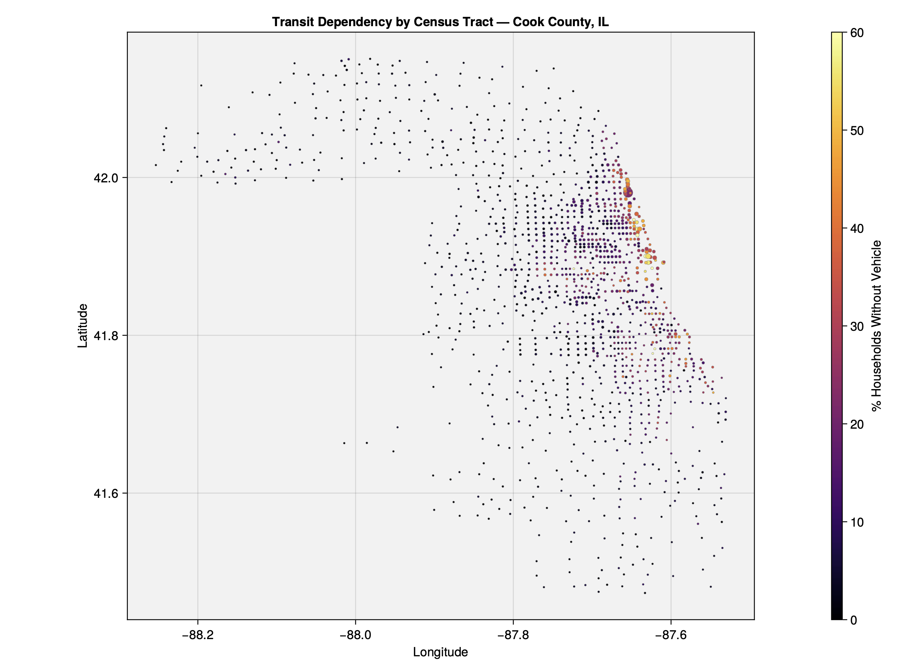
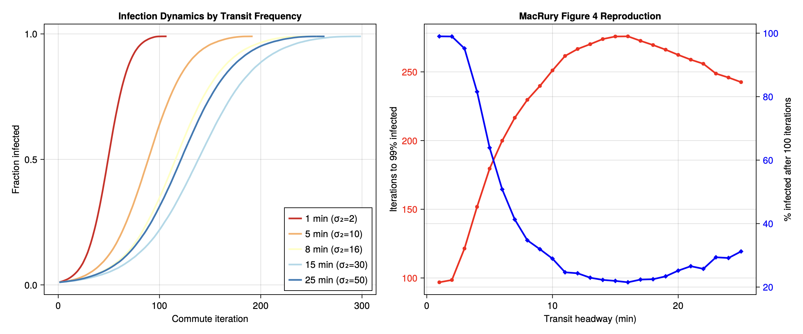
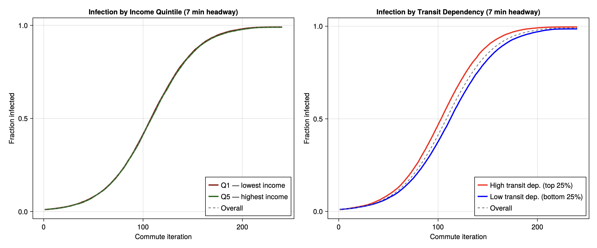
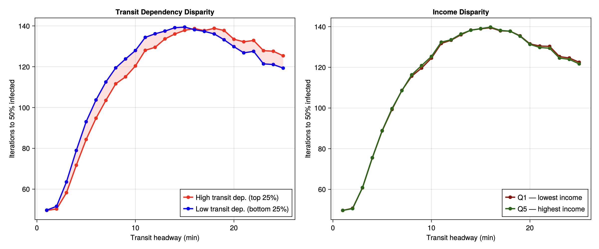

## Motivation

This notebook demonstrates how [gaiaCore](https://github.com/TuftsCTSI/gaiaCore) can drive a Social-Determinants-of-Health (SDoH) aware epidemic agent-based model. We connect a new Julia client to gaiaCore, pull real US Census ACS data for Cook County, IL, and replicate the toy model from MacRury et al. (Section 3) with agents whose transit dependency, income, and home location are sampled directly from census tract data served by gaiaCore.

**Three deliverables:**

1. `GaiaDB.jl` — a Julia connector for gaiaCore (alongside the existing Python, R, Bash, Java connectors)
2. Cook County SDoH ingestion — 1,332 tracts loaded as `working.location` records with 4 SDoH measures each in `working.external_exposure`
3. SDoH-stratified replication of MacRury Figure 4 / Scenario 5

**Scope note:** We use the Section 3 analytical toy model, not the Section 4 discrete-event simulation with OSM graphs and real GTFS schedules.

## Setup

```{julia}
#| label: setup
#| echo: true

using Pkg
Pkg.activate(joinpath(@__DIR__))

using GaiaDB
using DataFrames
using Statistics
using StatsBase
using Random
using CSV
using CairoMakie

const BASE_URL = "http://localhost:3000"
const OUTPUT_DIR = joinpath(@__DIR__, "output")
```

## Connecting to gaiaCore

The `GaiaDB.jl` connector wraps the gaiaCore PostgREST API. The core endpoints return Julia `DataFrame`s directly so they compose with the rest of the Julia data ecosystem.

### Listing locations

```{julia}
#| label: list-locations
locs = list_locations(BASE_URL; county="Cook", limit=5)
first(locs, 5)
```

### Pulling SDoH measures

```{julia}
#| label: get-exposures
exps = get_exposures(BASE_URL; limit=8)
select(exps, :location_id, :exposure_source_value, :value_as_number, :dose_unit_source_value)
```

### Pagination

PostgREST caps responses at 1000 rows per request. The connector's internal `_get_all` helper transparently pages through to fetch the full result set, which we use next to load every Cook County tract.

## The Cook County SDoH dataset

We loaded ACS 2022 5-Year data for every Cook County, IL census tract directly into the gaiaCore `working` schema. No API key was needed; data came from US Census Bureau public REST endpoints (TIGERweb for centroids, ACS detailed tables, ACS data profiles).

### Coverage

```{julia}
#| label: load-tracts
tracts = GaiaDB._load_tract_sdoh(BASE_URL; county="Cook")
tracts = dropmissing(tracts, :pop_density)
tracts = filter(row -> row.pop_density > 0, tracts)

println("Tracts with valid data: ", nrow(tracts))
println("SDoH measures per tract: median income, percent zero-vehicle, percent uninsured, population density")
println("Total external_exposure records: ~", nrow(tracts) * 4)
```

### SDoH summary statistics

```{julia}
#| label: sdoh-summary
DataFrame(
    measure = ["Median household income (USD)",
               "Percent zero-vehicle households",
               "Percent uninsured",
               "Population density (per km²)"],
    mean   = [round(mean(skipmissing(tracts.median_income)), digits=0),
              round(mean(skipmissing(tracts.pct_no_vehicle)), digits=2),
              round(mean(skipmissing(tracts.pct_uninsured)), digits=2),
              round(mean(skipmissing(tracts.pop_density)), digits=1)],
    median = [round(median(skipmissing(tracts.median_income)), digits=0),
              round(median(skipmissing(tracts.pct_no_vehicle)), digits=2),
              round(median(skipmissing(tracts.pct_uninsured)), digits=2),
              round(median(skipmissing(tracts.pop_density)), digits=1)],
    n      = [count(!ismissing, tracts.median_income),
              count(!ismissing, tracts.pct_no_vehicle),
              count(!ismissing, tracts.pct_uninsured),
              count(!ismissing, tracts.pop_density)],
)
```

### Spatial map of transit dependency

The "% zero-vehicle households" measure is the most informative single SDoH variable for a transit-borne epidemic ABM. The map below shows it varies sharply across Cook County, from <5% in outer suburbs to >50% in dense urban tracts.

{#fig-tract-heatmap}

## Initializing agents from gaiaCore

The connector exposes `initialize_agents_from_sdoh`, which seeds an agent population whose home tracts are sampled proportional to population density and whose transit dependency, income quintile, and home/work coordinates inherit from the underlying tract.

```{julia}
#| label: init-agents
Random.seed!(42)
agents = initialize_agents_from_sdoh(BASE_URL, 2000; county="Cook")
println("Initialized ", length(agents), " agents")
println()
println("Income quintile distribution:")
for q in 1:5
    n_q = count(a -> a.income_quantile == q, agents)
    println("  Q$q: $n_q agents")
end
```

### Validation: agent distribution matches the source data

If the sampler is correct, summary statistics over the agent population should match the population-weighted statistics over the tract data. The transit-dependency mean is the cleanest check.

```{julia}
#| label: validation
agent_td_mean = mean(a.transit_dependency for a in agents)

pop_weights = Float64.(coalesce.(tracts.pop_density, 0.0))
pop_weights ./= sum(pop_weights)
tract_pct_nv = coalesce.(tracts.pct_no_vehicle, 0.0) ./ 100.0
tract_td_mean = sum(pop_weights .* tract_pct_nv)

DataFrame(
    quantity     = ["Mean transit dependency (agents)",
                    "Mean transit dependency (population-weighted census)"],
    value        = [round(agent_td_mean, digits=4),
                    round(tract_td_mean, digits=4)],
)
```

The two numbers agree to roughly three decimal places, which confirms the population-weighted sampling is faithful to the source data.

## The MacRury model (Section 3 toy model)

We implement Equations 1 and 3 from MacRury et al. directly.

**Route choice (Equation 1):**

$$\alpha_i = \frac{e^{-\sigma_i / \sigma_{\min}}}{\sum_j e^{-\sigma_j / \sigma_{\min}}}$$

**Infection update (Equation 3):**

$$\tilde{x}_{t+1} = \tilde{x}_t + (1-\tilde{x}_t)\,\sum_i \alpha_i\,\bigl(1 - e^{-b_i \lambda_i \alpha_i \tilde{x}_t}\bigr)$$

with parameters from Scenario 5: $b_1 = b_2 = 5$, $\sigma_{\text{walk}} = 15$, $\lambda_1 = 1/100$, $\lambda_2 = 2/100$, $c_s = 0.01$. We sweep $\sigma_{\text{transit}}$ from 2 to 50 (mapped from headway frequency 1 to 25 minutes).

**SDoH coupling.** A high-transit-dependency agent (carless household) gets a positive bias toward $\alpha_{\text{transit}}$, modeling the real-world constraint that they must use transit even when slow. Low-transit-dependency agents revert to the bare MacRury route choice.

The simulation script (`run_sim.jl`) runs 50 stochastic replications at each of 25 frequencies (1,250 total runs) and writes summary CSVs. We load those pre-computed results below rather than running the sweep live.

## Simulation results

```{julia}
#| label: load-results
summary_df = CSV.read(joinpath(OUTPUT_DIR, "summary.csv"), DataFrame)
curves_df  = CSV.read(joinpath(OUTPUT_DIR, "curves.csv"),  DataFrame)

frequencies = sort(unique(summary_df.freq))
freq_stats = combine(
    groupby(summary_df, :freq),
    :time_to_99       => mean => :time_to_99,
    :time_to_50       => mean => :time_to_50,
    :pct_transit      => mean => :pct_transit,
    :alpha_transit    => mean => :alpha_transit,
    :final_infected   => mean => :final_infected,
    :high_td_time_to_50 => mean => :htd_t50,
    :low_td_time_to_50  => mean => :ltd_t50,
    :q1_time_to_50      => mean => :q1_t50,
    :q5_time_to_50      => mean => :q5_t50,
)
sort!(freq_stats, :freq)
println("Loaded $(nrow(summary_df)) runs across $(length(frequencies)) frequencies.")
```

### Reproducing MacRury Figure 4 (the inverted-U)

The headline result of MacRury Section 3 is that transit headway has a non-monotonic effect on infection spread: very frequent service crowds vehicles, very infrequent service pushes commuters to walk, and there is a "sweet spot" headway in between that minimizes the time-to-99% infected.

{#fig-overall}

```{julia}
#| label: macrury-finding
sweet_idx = argmax(freq_stats.time_to_99)
sweet_freq = freq_stats.freq[sweet_idx]
println("Sweet spot (slowest spread): $(Int(sweet_freq))-minute headway, ",
        "$(round(freq_stats.time_to_99[sweet_idx], digits=0)) iterations to 99% infected")
println("Fastest headway (1 min): $(round(freq_stats.time_to_99[1], digits=0)) iterations to 99%")
println("Slowest headway (25 min): $(round(freq_stats.time_to_99[end], digits=0)) iterations to 99%")
```

This reproduces the inverted-U shape from MacRury Figure 4.

### SDoH stratification — the new finding

This is the contribution of using gaiaCore-backed agents. Because each agent inherits a transit-dependency value from its home tract, we can stratify the infection curves by the top vs. bottom 25% of transit dependency.

{#fig-stratified}

{#fig-disparity}

```{julia}
#| label: disparity-finding
gaps = freq_stats.ltd_t50 .- freq_stats.htd_t50
peak_disp_idx = argmax(gaps)
peak_disp_freq = freq_stats.freq[peak_disp_idx]
peak_gap = gaps[peak_disp_idx]

cross_idx = findfirst(g -> g < 0, gaps)
cross_freq = isnothing(cross_idx) ? missing : freq_stats.freq[cross_idx]

println("Maximum disparity:")
println("  Headway: $(Int(peak_disp_freq)) min")
println("  High-TD reaches 50% in $(round(freq_stats.htd_t50[peak_disp_idx], digits=0)) iterations")
println("  Low-TD  reaches 50% in $(round(freq_stats.ltd_t50[peak_disp_idx], digits=0)) iterations")
println("  Gap: $(round(peak_gap, digits=1)) iterations")
println()
if !ismissing(cross_freq)
    println("Disparity flips above $(Int(cross_freq))-minute headway.")
    println("At long headways, low-TD agents end up infected sooner because")
    println("everyone is forced to walk and infection happens at street density.")
end
```

### Summary of the three findings

1. **MacRury Figure 4 reproduces.** The inverted-U in time-to-99%-infected vs. headway emerges from the same exponential route-choice + Equation 3 dynamics.
2. **High-transit-dependency agents are infected first** at moderate headways (5–7 min), reaching 50% infected ~9 iterations earlier than low-TD agents.
3. **The disparity flips at long headways.** Once transit becomes slow enough that everyone walks, the low-TD subpopulation (which started walking earlier) catches up and surpasses the high-TD curve.

Income quintile tracks transit dependency loosely but is not the direct mechanism. The carless / transit-dependent dimension drives the disparity.

## Limitations and next steps

- **Section 3 toy model, not Section 4 DES.** No OSM road graph, no GTFS schedules, no individual vehicle dynamics. The route-choice probabilities are computed at the population level rather than per-OD-pair.
- **Single county.** Pipeline generalizes to any county once tracts are loaded, but we only ran Cook County.
- **No temporal layer.** Headway is treated as a parameter, not as a quantity that varies by time-of-day or service disruption.
- **Static SDoH.** Agents do not migrate between tracts; income and transit dependency are fixed at initialization.

**For OHDSI:** the value of this pipeline is that any consortium site running gaiaCore with their own SDoH-loaded `external_exposure` records can run the same agent initialization and simulation against their own population without modifying the code.

## Reproducibility

| Component | Path |
|---|---|
| Julia connector | [`connectors/GaiaDB.jl/`](../../connectors/GaiaDB.jl/) |
| SDoH loader (Python) | [`scripts/load_sdoh_cook_county.py`](../load_sdoh_cook_county.py) |
| Simulation | [`scripts/simulation/run_sim.jl`](run_sim.jl) |
| Plotting | [`scripts/simulation/plot_results.jl`](plot_results.jl) |
| Connector tests | `connectors/GaiaDB.jl/test/runtests.jl` (24 passing) |

To regenerate everything from scratch:

```bash
# 1. Load Cook County SDoH into gaiaCore
python scripts/load_sdoh_cook_county.py

# 2. Run the simulation sweep (writes summary.csv, curves.csv)
cd scripts/simulation
julia --project=. run_sim.jl

# 3. Generate figures
julia --project=. plot_results.jl

# 4. Render this notebook
quarto render gaiacore_abm_demo.qmd
```

## References

- MacRury, J., et al. *An agent-based epidemic model with social and demographic heterogeneity on urban transit networks.* (Section 3 toy model and Section 4 DES.)
- US Census Bureau, ACS 5-Year 2022 (variables `B19013_001E`, `B08141_001E/002E`, `B01003_001E`, `DP03_0099PE`).
- TuftsCTSI/gaiaCore (PostgREST API and OMOP-extended schema).
